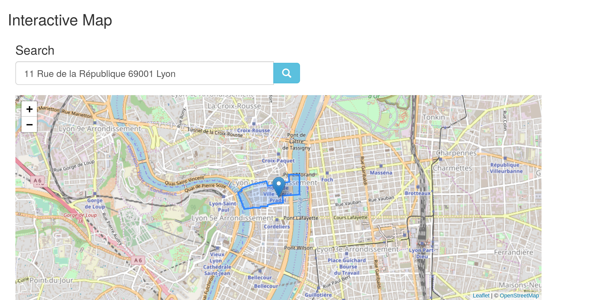
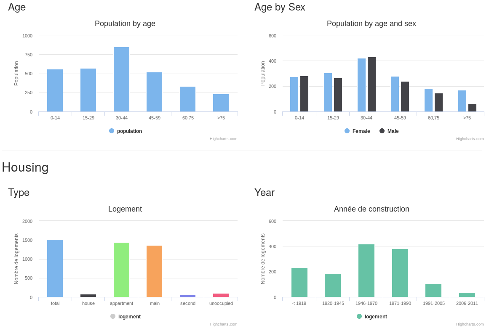
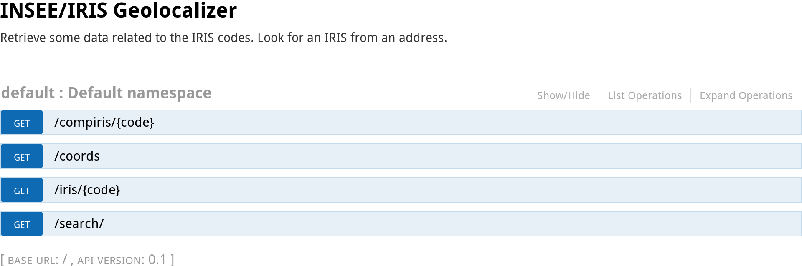

Pyris
=====

IRIS Insee Geolocalizer

Pyris collects some data about
`IRIS <http://www.insee.fr/fr/methodes/default.asp?page=zonages/iris.htm>`__
from the French `INSEE <http://www.insee.fr/en/>`__ institute. It's
possible from an address to find the IRIS code and some **statistics
data**, e.g. population, employment or housing data.

`IRIS <http://www.insee.fr/fr/methodes/default.asp?page=zonages/iris.htm>`__
are specific codes and data related to more than 50,000 districts, built
by the `National Institute of Statistics and Economic
Studies <http://www.insee.fr/en/>`__.

-  Running instance http://pyris.datajazz.io/
-  API documentation at http://pyris.datajazz.io/doc/

Interactive Map
---------------

   map

IRIS stats
----------

Some Insee stats for each IRIS, census 2013: population (by sex and
age), employment and housing.

   iris-stats

REST API documentation
----------------------

   api

For instance, you can:

-  ``URL/iris/0104?limit=5`` to the some information about a specific
   IRIS code

-  ``URL/search/q=place de la bourse Bordeaux`` to get the IRIS data
   from a specific address

Data
----

You have to install postgreSQL and PostGIS. For Debian:

::

    sudo apt-get install postgresql postgis

You have to be a PostgreSQL superuser to create the postgis extension
for your database. If it's not the case, you can do:

-  ``su``
-  ``su - postgres``
-  ``psql pyris -c "CREATE EXTENSION postgis;"``

All usefull scripts are in the `scripts-data` folder. Two steps:

* Download and some data processing for IGN and Insee data. Take a look to the
  `Makefile` in `scripts-data`.

* Then load data into your database thanks to the Python script `loader.py`.

To summarize, in a dedicated virtualenv, do:

1. Go to `scripts-data`
2. Run `make all`
3. Run `python loader.py ./data`

For Python dependencies which help you to process data, take a look to the
`scripts-data/requirements.txt` file.

You also have a configuration file example at `scripts-data/settings.ini.sample`.

Launch the Web App
------------------

First, download the few CSS & JavaScript dependencies with a
``bower install`` (just a Bootstrap and jQuery).

Then : ``> gunicorn -b 127.0.0.1:5555 pyris.api.run:app`` or
``> gunicorn -b 127.0.0.1:5555 --env PYRIS_APP_SETTINGS=./appdev.yml pyris.api.run:app``
if you have to specify db credentials or logging Flask app
configuration.

See an `example of a app.yml
file <https://github.com/garaud/pyris/blob/master/app.yml>`__

Visit http://localhost:5555/pyris

Requirements
------------

-  postgresql
-  postgis

-  flask
-  flask restplus
-  psycopg2
-  slumber
-  pyaml
